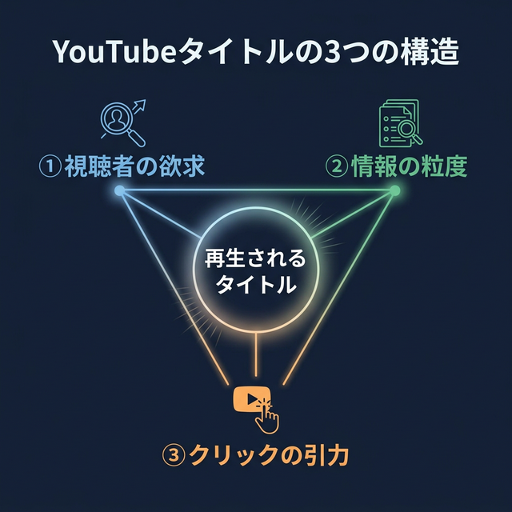
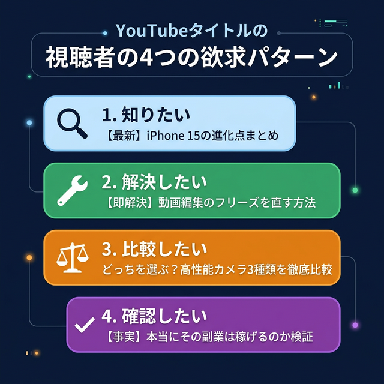
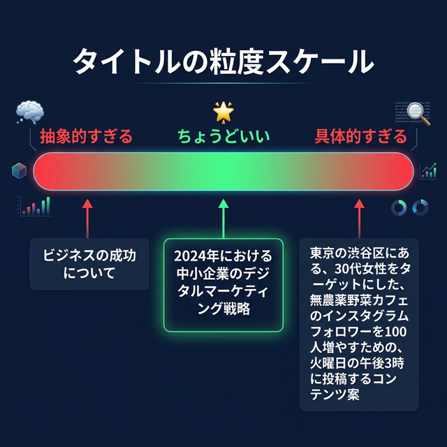
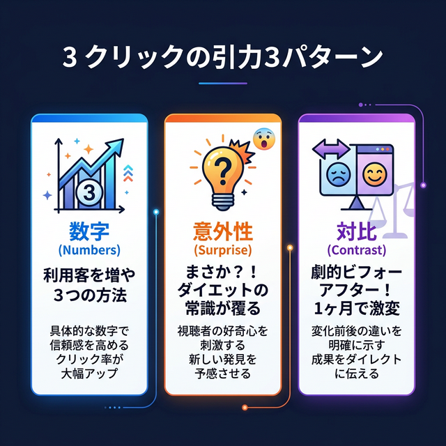
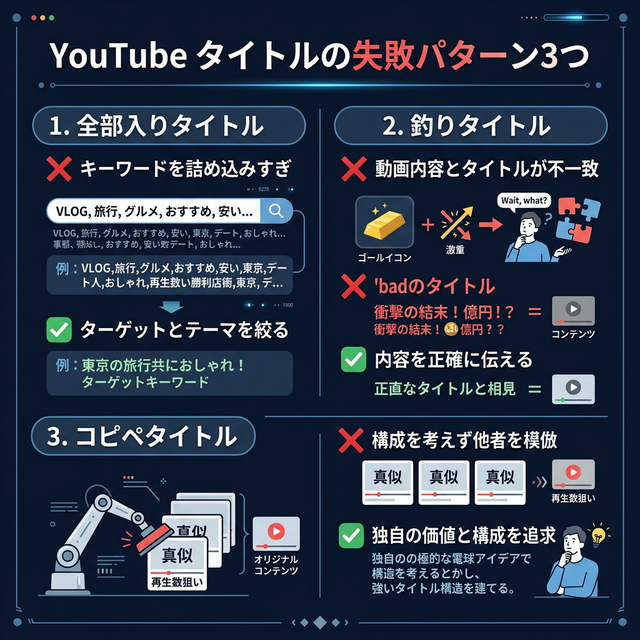

# YouTubeタイトルの考え方｜センスじゃなく構造で作る

動画を頑張って作ったのに、再生されない。
タイトルが大事だとは聞くけど、「良いタイトル」がどうしても思いつかない——。

僕も最初の頃、そうでした。

「こういうタイトルがウケるらしい」と聞いて真似してみたり、
他のチャンネルのタイトルをそのまま参考にしてみたり。

でも、全然うまくいかなかった。

なんでだと思います？

答えは単純で、**タイトルの「考え方」を知らなかったから**です。

「タイトルが大事」は知っている。
でも「タイトルをどう考えればいいか」は誰も教えてくれない。

12年YouTubeをやってきて、ようやく気づいたことがあります。

**再生されるタイトルには「構造」がある。**

センスの問題じゃないんです。
考え方の手順を知っているかどうか——ただそれだけの違いでした。

この記事では、タイトルを考えるときに使える**3つの構造**を、具体例をたっぷり交えながら紹介します。

前半では全体像と最初の構造を、後半では残りの2つの構造と失敗パターン、さらに実践ワークまでお伝えします。

読み終わったとき、「次の動画のタイトル、早く考えたい」と思ってもらえたら嬉しいです。

---

## この記事で手に入るもの

結論から言うと、再生されるタイトルには**3つの構造**があります。

**① 視聴者の欲求に刺す** — そもそも誰の何に応える動画なのか
**② 情報の粒度を合わせる** — 広すぎず、狭すぎず
**③ クリックの引力を作る** — 「気になる」「見たい」を設計する

この3つを**①→②→③の順番で**チェックすれば、「タイトルが思いつかない」で止まることがなくなります。

いきなり「キャッチーな言葉を探そう」とするから迷子になるんです。
順番に考えていけば、タイトルが自然と形になります。

「タイトルにセンスが必要」と思っている方。安心してください。
これは技術です。手順にしたがえば、誰でもできます。

---

## なぜ「いいタイトル」が思いつかないのか

### タイトルで悩む人に共通する特徴

タイトルで悩む人に話を聞くと、ほぼ全員がこう言います。

「何を基準に考えればいいか分からない」

多くの人は、タイトルを考えるとき、こんなふうにやっています。

- 「とりあえず内容が分かるようにしよう」→ 説明文みたいなタイトルになる
- 「あの人のタイトルが伸びてたから真似しよう」→ 表面だけコピーして不発
- 「キーワードを入れればいいんでしょ？」→ テクニックの寄せ集めになる
- 「インパクトのある言葉を入れよう」→ 内容と合わなくなる

これ、全部「手順」がないから起きるんです。

料理と同じです。
レシピなしにいきなり「なんか美味しいもの作ろう」と思っても、うまくいかない。
でもレシピ（構造）があれば、初心者でもちゃんとした料理が作れます。

タイトルも、まったく同じ。
必要なのはセンスじゃなく、**考える順番**です。

### 「他の人のタイトルを真似してもうまくいかない」理由

ここでよくある疑問に答えておきます。

「伸びてるチャンネルのタイトルを参考にすればいいんじゃないの？」

たしかに、伸びているタイトルを研究するのは大事です。
でも、**表面だけ真似してもうまくいきません**。

なぜかというと、伸びているタイトルが再生されるのは、そのタイトル単体の力じゃないからです。

チャンネルの知名度、ジャンルの相場、視聴者との信頼関係——
そういった**文脈**があって初めて機能しているんです。

100万登録のチャンネルが「ぶっちゃけます」ってタイトルで伸びるのは、「この人のぶっちゃけが聞きたい」という信頼があるから。
登録100人のチャンネルが同じタイトルをつけても、誰も「ぶっちゃけ」に興味を持ちません。

じゃあどうすればいいか？

**真似するのは「言葉」ではなく「構造」です。**

「このタイトルが伸びたのは、3つの構造のどれが効いているから？」
そう分析して、構造だけを自分のテーマに適用する。

これが、12年やってきて僕がたどり着いた結論です。

### タイトルは「3つの構造」で分解できる

12年で、数え切れないタイトルを作ってきました。

うまくいったもの。全然ダメだったもの。
その違いを整理してみたら、**3つの構造**に分けることができました。

- **構造① 視聴者の欲求に刺す** — そもそも「誰の何に応える動画か」を明確にする
- **構造② 情報の粒度を合わせる** — 広すぎず狭すぎず、ちょうどいいスコープにする
- **構造③ クリックの引力を作る** — 「気になる」「見たい」と思わせる仕掛けを入れる

この順番がポイントです。

①で方向を決め、②でスコープを絞り、③で引力を加える。
3ステップで、タイトルが組み上がります。

では、それぞれ詳しく見ていきましょう。

---

## 構造①「視聴者の欲求に刺す」

### 「自分が伝えたいこと」ではなく「相手が知りたいこと」

タイトルを考えるとき、最初に考えるべきは**「視聴者が何を求めているか」**です。

初心者がやりがちなのは、**「自分が伝えたいこと」をタイトルにしてしまう**こと。

これ、僕も散々やりました。

たとえば、動画編集のコツを紹介する動画で：

❌ 「僕がいつもやっている編集テクニック」
✅ 「動画編集に3時間かかる人が1時間に短縮する方法」

前者は「自分目線」、後者は「視聴者目線」です。

もう少し例を見てみましょう。

❌ 「私のおすすめカメラを紹介します」
✅ 「初めてのYouTube撮影に必要なカメラの選び方」

❌ 「最近ハマっている作業効率化の話」
✅ 「動画投稿を週3本にするための時間管理術」

❌ 「動画編集ソフトのレビュー」
✅ 「無料で使える動画編集ソフト、初心者に一番おすすめはどれ？」

違いが分かりますか？

**「自分が話したいこと」を「相手が知りたいこと」にひっくり返すだけ**で、タイトルの刺さり方がまるで変わります。

チェック方法はシンプルです。
タイトルを考えたら、こう自問してみてください。

> 「このタイトル、"僕が"で始まっていないか？」

もし自分が主語になっていたら、視聴者を主語に書き換える。
それだけで、構造①はクリアです。

### 欲求のパターンは4つしかない

「視聴者目線って言われても、相手が何を求めてるかなんて分からないよ」

そう思うかもしれません。
でも、実は視聴者の欲求パターンは**たった4つ**しかありません。

**1. 知りたい** — 「◯◯って何？」「◯◯のやり方は？」
**2. 解決したい** — 「◯◯がうまくいかない」「◯◯で困っている」
**3. 比較したい** — 「AとBどっちがいい？」「◯◯の選び方は？」
**4. 確認したい** — 「自分のやり方は合ってる？」「◯◯って本当？」

自分の動画が、この4つのうち**どれに応えるものかを決める**。
それだけで、タイトルの方向性が定まります。

ジャンル別に具体例を見てみましょう。

**「知りたい」の場合：**
- 「YouTubeショートの作り方｜初心者向け完全ガイド」
- 「アナリティクスの見方｜最初に確認すべき3つの数字」
- 「YouTube収益化の条件を分かりやすく解説」

**「解決したい」の場合：**
- 「動画のアクセスが急に落ちたときに見直すべきこと」
- 「サムネイルを変えても再生数が増えない原因と対策」
- 「チャンネル登録者が全然増えないときの処方箋」

**「比較したい」の場合：**
- 「プレミアプロ vs ダビンチリゾルブ｜初心者はどっち？」
- 「縦動画と横動画、今から始めるならどっちが有利？」
- 「Canva vs Photoshop｜サムネイル作るならどっち？」

**「確認したい」の場合：**
- 「YouTubeの投稿時間、本当に朝が有利なのか検証」
- 「登録者1000人までにやったこと、意味があったのはどれ？」
- 「概要欄ってちゃんと読まれてるの？データを見て分かったこと」

ここで大事なのは、**1つの動画に対して欲求は1つに絞る**ということ。

「知りたい」と「解決したい」を両方入れようとすると、タイトルがぼやけます。
「この動画は"解決したい"に応える動画だ」と決めてしまう。

「僕の動画は、視聴者の"どの欲求"に応えているか？」

この問いをタイトルを考える**一番最初に**持つだけで、精度は大きく変わります。

---

ここまでの「構造① 視聴者の欲求に刺す」だけでも、タイトルの考え方はかなり変わるはずです。

ここから先では、残りの2つの構造——**「情報の粒度」**と**「クリックの引力」**を解説します。
さらに、3つの構造を使って実際にタイトルを作る**実践ワーク**もお見せします。

この3つが揃うと、タイトルを作るときに「何を考えればいいか」が毎回クリアになります。

気になった方は、ぜひ読んでみてください。

---

--- ここから有料 ---

## 構造②「情報の粒度を合わせる」

### 広すぎても狭すぎてもクリックされない

構造①で「誰のどんな欲求に応えるか」を決めたら、次は**粒度の調整**です。

タイトルには「ちょうどいい粒度」があります。

たとえば、YouTubeの始め方を解説する動画で：

❌ **広すぎ**：「YouTubeの始め方」
→ 範囲が広すぎて、「自分に合う内容かどうか」が判断できない。結果、スルーされる。
→ このタイトルで検索する人はいるかもしれないけど、上位はもっと登録者の多いチャンネルに取られる。

❌ **狭すぎ**：「YouTubeスタジオのダッシュボードのインプレッションのクリック率の横の矢印アイコンの意味」
→ ニッチすぎて、そもそも検索する人がほぼいない。
→ タイトルとしても長すぎて、途中で切れてしまう。

✅ **ちょうどいい**：「YouTube初心者が最初の1本を投稿するまでの手順」
→ 「初心者」×「最初の1本を投稿する」で、ちょうど良いスコープ。
→ このタイトルを見た初心者は「まさに自分のための動画だ」と思える。

広すぎると「自分向けか分からない」からスルーされます。
狭すぎると「そもそも需要がない」から検索されません。

この**真ん中のゾーン**を見つけることが、タイトル作りの2つめのステップです。

### 「誰の、何の」を入れるだけで粒度が決まる

粒度の調整って、難しそうに聞こえますよね。

でも実はシンプルなコツがあります。
タイトルに**「誰の」**と**「何の」**を入れるだけです。

- **「誰の」** = ターゲットを限定する言葉
  - 例：初心者、登録者100人以下、副業YouTuber、40代から始める人、顔出しなし
  
- **「何の」** = 具体的な課題
  - 例：タイトル、サムネイル、概要欄、投稿頻度、ネタ探し、台本の作り方

この2つを意識するだけで、タイトルの焦点がぐっと絞れます。

Before/After で比べてみましょう。

**例1：**
❌ Before：「再生数を増やす方法」
→ 誰のどの課題か分からない。YouTuber歴10年の人にも初心者にも向けてない。

✅ After：「登録者100人以下のYouTuberがまず見直すべきタイトルの考え方」
→ 「登録者100人以下」（誰の）＋「タイトル」（何の）で粒度が定まる。

**例2：**
❌ Before：「YouTubeで成功する秘訣」
→ 抽象的すぎる。「成功」が何を指すかも不明。

✅ After：「副業でYouTubeを始めた人が最初の3ヶ月でやるべきこと」
→ 「副業で始めた人」（誰の）＋「最初の3ヶ月」（何の）で具体的。

**例3：**
❌ Before：「サムネの作り方」
→ まだ広い。Photoshop使う人向け？Canva使う人向け？

✅ After：「Canvaだけで作れる初心者向けサムネイルの型3選」
→ 「Canvaだけ」「初心者向け」で対象が明確。ツールまで指定されてるから安心感もある。

**例4：**
❌ Before：「概要欄の書き方」
→ 何を書けばいいか漠然と知りたい人なのか、テンプレが欲しい人なのか分からない。

✅ After：「概要欄のテンプレート｜初心者がそのまま使える書き方」
→ 「初心者」（誰の）＋「テンプレート」（何の）で具体的。

### 粒度チェックの方法

タイトルができたら、こう自問してみてください。

> 「このタイトルを見た人が、"自分のための動画だ"と**3秒で**判断できるか？」

答えがNOなら、「誰の」か「何の」が足りていません。

もう一つのチェック方法として、**友人に説明するテスト**があります。

「次の動画、何について撮ったの？」と聞かれたとき、
「◯◯な人が、◯◯するための動画」と30文字以内で答えられるか。

答えられるなら、粒度はちょうどいいです。
答えが長くなるなら、まだ絞り切れていません。

---

## 構造③「クリックの引力を作る」

### 「気になる」は設計できる

構造①で方向を決め、構造②でスコープを絞った。

最後のステップは、**「クリックしたくなる引力」を加える**ことです。

人がタイトルをクリックするのは、**「この先に答えがある」と感じたとき**。

逆に言えば、「答えが全部見えてしまうタイトル」はクリックされません。
「動画編集のコツは速度調整です」——これだとタイトルで完結してしまいますよね。

この「気になる」を作るテクニックは、大きく3つあります。

### ① 数字を入れる

数字があると、「具体的な答えがこの先にある」と感じやすくなります。

**例：**
- 「サムネで失敗する**3つ**のパターン」
- 「再生数を**2倍**にしたたった**1つ**の変更」
- 「チャンネル登録者**1000人**までにやった**5つ**のこと」
- 「初心者が**最初の30日**でやるべきこと」

ポイントは、**奇数の方が印象に残りやすい**こと。
「3つ」「5つ」「7つ」は定番です。

ただし、数字を入れすぎると逆効果になります。
「3つの方法で5倍に増やす7日間プラン」——これは数字酔いします。

1タイトルに数字は**1〜2個まで**が目安です。

### ② 意外性を出す

常識と少しずれた角度をつけると、「え、どういうこと？」と引っかかります。

**例：**
- 「再生されないのはタイトルが"**良すぎる**"から」
- 「YouTube初心者は**毎日投稿しないほうがいい**理由」
- 「サムネイルは**文字を減らす**と再生される」
- 「登録者を**増やそうとしない**ほうが伸びた話」

ここで大事なのは、**「嘘」ではなく「角度」**だということ。

動画の中身でちゃんと根拠を示せる範囲で、視点をずらす。
「え？」と思わせておいて、見たら「なるほど」と納得できる——これが理想です。

逆に、根拠がないのに逆張りするのはNGです。
それは「意外性」ではなく「嘘」になってしまう。

意外性は強力ですが、使いすぎると「毎回逆張りする人」になるのでほどほどに。
3〜5本に1回ぐらいがちょうどいいです。

### ③ 対比を使う

Before/After、◯◯ vs ◯◯で差を見せると、**「自分はどっちだろう」**と引き込まれます。

**例：**
- 「再生される人と**されない人**のタイトルの違い」
- 「**月1万回**の動画と**月10万回**の動画、タイトルの差は何か」
- 「初心者が**やりがちなこと** vs **やるべきこと**」
- 「**伸びるチャンネル**と**止まるチャンネル**の決定的な違い」

対比が効くのは、読者が**自分を重ねやすい**から。
「自分はどっち側だろう？」と思った時点で、もうクリックしたくなっています。

特に「伸びる vs 伸びない」系は、誰もが自分を当てはめて考えたくなる構造です。

### 3つの引力の使い分け

全部使う必要はありません。

**「この動画のタイトルに、3つのうちどれか1つ入れられないかな？」**

そう考えるだけで十分です。

迷ったら、まず**数字**から試してみてください。一番使いやすいです。
大きな失敗もしにくい。

慣れてきたら、意外性や対比も組み合わせてみる。

組み合わせの例：
- **数字 × 対比** → 「再生される動画とされない動画の**3つの**違い」
- **意外性 × 数字** → 「**やめたら伸びた**3つのこと」
- **対比 × 意外性** → 「努力する人ほど**伸びない**YouTubeの罠」

---

## 3つの構造を使ったタイトルの作り方（実践ワーク）

ここまでの3つの構造を、実際にどう使うか。
2つのテーマで実践してみましょう。

### 実践例1：「サムネイルの作り方」を解説する動画

**Step1: 構造①「欲求に刺す」**
→ この動画は「知りたい」×「解決したい」系
→ ターゲット：サムネの作り方が分からないYouTube初心者

**Step2: 構造②「粒度を合わせる」**
→ 「誰の」＝ YouTube初心者、Canvaを使う人
→ 「何の」＝ サムネイルデザインの基本パターン
→ 仮タイトル：「Canvaで作る初心者向けサムネイルの基本」

**Step3: 構造③「引力を作る」**
→ 数字を入れてみる：「Canvaで作る初心者向けサムネの型**3選**」
→ 対比を入れてみる：「クリックされるサムネと**スルーされる**サムネの違い」

**完成タイトル案：**
✅ 「YouTube初心者がCanvaで作れるサムネの型3選｜これだけで変わります」

### 実践例2：「チャンネル登録者を増やす方法」を解説する動画

**Step1: 構造①「欲求に刺す」**
→ 「解決したい」系。登録者が増えずに悩んでいる人
→ ターゲット：登録者が伸び悩んでいる初心者

**Step2: 構造②「粒度を合わせる」**
→ 「誰の」＝ 登録者100人前後で伸び悩んでいる人
→ 「何の」＝ 登録者を増やすために見直す設定やコンテンツ
→ 仮タイトル：「登録者100人で止まった人が見直すべきこと」

**Step3: 構造③「引力を作る」**
→ 数字を入れる：「登録者100人から抜け出す**5つ**の改善ポイント」
→ 意外性を入れる：「登録者が**増えない原因はコンテンツじゃない**かもしれない」

**完成タイトル案：**
✅ 「登録者100人で止まる人に共通する5つの見落とし」

どちらも、①→②→③と順番に考えるだけで、自然とタイトルが形になるのが分かると思います。

---

## よくある失敗パターン3つ

3つの構造を理解した上で、やってしまいがちな失敗パターンも共有しておきます。

知っておくだけで避けられるものばかりです。

### 失敗① 全部入りタイトル

情報を詰め込みすぎて、何の動画か分からなくなるパターンです。

❌ 「初心者YouTuberがサムネとタイトルと概要欄とタグと投稿時間を改善して再生数とチャンネル登録者数を増やす完全ガイド」

これは構造②（粒度）が崩壊しています。
1つの動画で全部伝えようとしている。

**直し方：1動画1テーマに絞る。**

「この動画で一番伝えたいことは何？」と自問して、答えを1つに絞る。
タイトルで伝えることも、その1つだけにする。

✅ 「初心者YouTuberが最初に直すべきはサムネイル｜理由と手順」

### 失敗② 釣りタイトル

クリックさせるために、内容とかけ離れたタイトルをつけるパターンです。

❌ 「この方法で月100万円稼いだ」（実際は入門レベルの内容）
❌ 「衝撃の結果！◯◯を検証してみた！！」（実際は普通の結果）

釣りタイトルの問題は、**クリック率は上がっても、離脱率も上がる**こと。

YouTubeのアルゴリズムは「クリックされた後に、どれだけ見られたか」も見ています。
タイトルの期待値が高すぎると、内容とのギャップで即離脱される。
結果、動画の評価が下がって、表示される機会自体が減ります。

つまり、釣りタイトルは**短期的にはクリック率が上がっても、中長期的にはチャンネルを壊します**。

**直し方：クリックの引力は「嘘」ではなく「角度」で作る。**

✅ 「YouTubeで月10万円を目指す人が最初にやるべきこと」
→ 内容に誠実で、かつ「知りたい」と思わせるタイトル

### 失敗③ コピペタイトル

伸びている人のタイトルをそのまままるごとコピーするパターンです。

❌ 有名YouTuberのタイトルをフォーマットごと真似

さっきも触れましたが、伸びているタイトルが再生されるのは、チャンネルの文脈（登録者数、ジャンル、信頼関係）があるから。

表面をコピーしても、あなたのチャンネルでは同じ結果にはなりません。

**直し方：フォーマットではなく構造を学ぶ。**

「この人のタイトルが伸びたのは、3つの構造のうちどれが効いているから？」
そう分析して、構造だけを自分のテーマに適用する。

✅ 真似するのは「言葉」ではなく「考え方」

---

## まとめ｜次の動画から試してみてください

再生されるタイトルには、3つの構造があります。

**1. 構造① 視聴者の欲求に刺す**
→ 「知りたい・解決したい・比較したい・確認したい」のどれに応える動画か？

**2. 構造② 情報の粒度を合わせる**
→ 「誰の、何の」を入れてちょうどいいスコープに

**3. 構造③ クリックの引力を作る**
→ 数字・意外性・対比で「気になる」を設計する

この3つを**①→②→③の順番で**考える。
それだけで、タイトルは「なんとなく」ではなく**理由のある形**で組み上がります。

タイトルはセンスじゃありません。構造です。

まずは次の動画のタイトルを考えるとき、この3ステップで一度やってみてください。

**Step1：** 「この動画は、視聴者のどの欲求に応えているか？」
**Step2：** 「誰の、何の」で粒度を絞ったか？
**Step3：** 「数字・意外性・対比のどれか1つ入れられるか？」

この3つのチェックを通すだけで、タイトルの迷いがかなり減るはずです。

最初は少し時間がかかるかもしれませんが、5本も作れば自然と考え方が身につきます。
気がつけば、タイトルを考えるのが楽しくなっているかもしれません。

まず小さく、次の1本から試してみてください。

---

YouTubeの"その先"に興味がある方は、noteのフォローで最新記事をお届けします。

※ 本記事の制作にAIツールを活用しています。
