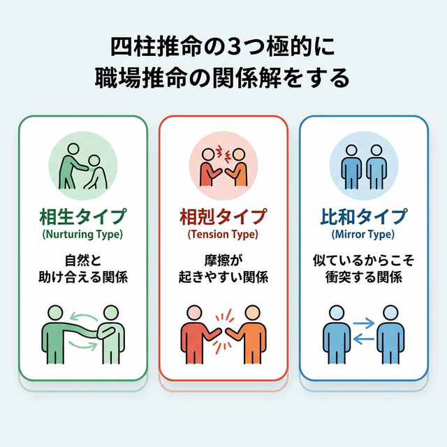
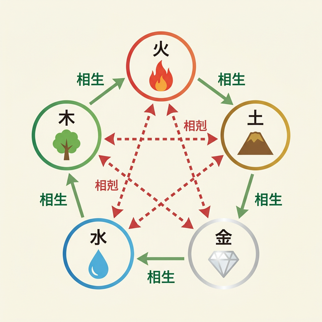
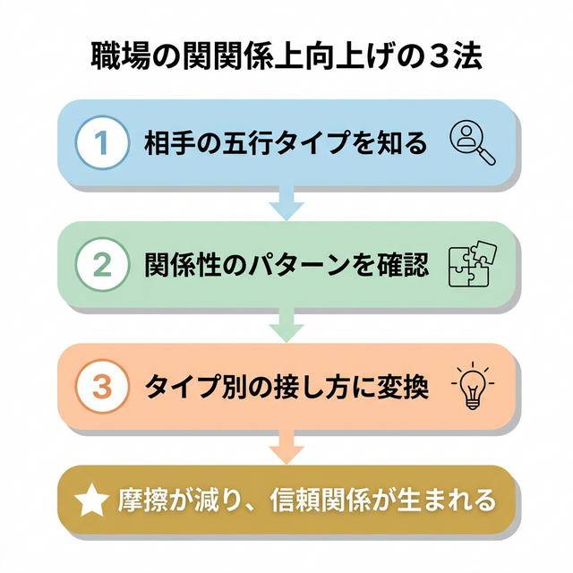

# 「なぜあの人とだけ、うまくいかないのか」——四柱推命で読み解く職場の人間関係

---

「何回言っても伝わらない部下がいる」
「自分のマネジメントが間違ってるのか？」
「チーム全体はうまく回ってるのに、あの一人だけ噛み合わない」

——30代で管理職になった人なら、一度は感じたことがあるんじゃないだろうか。

僕自身、32歳でチームリーダーになったとき、まさにこの壁にぶつかった。
7人のチームのうち、6人とはスムーズにやれていたのに、1人だけどうしても噛み合わない。

指示を出しても反応が薄い。
1on1をしても会話が空回りする。

「自分のコミュニケーション能力が足りないのか」と悩んで、マネジメント本を10冊以上読んだ。
でも、どのテクニックを試しても根本的な改善にならなかった。

転機になったのは、四柱推命だった。

この記事では、四柱推命の考え方を **「五行タイプ」という1つのフレームワーク** に集約して、**なぜ特定の相手とだけ噛み合わないのか**を読み解く方法を紹介します。

前半は五行タイプの基本と相性の仕組み（無料で読めます）。
後半は実際の職場ケースと、明日から使える具体的な対処法です。

---

## 四柱推命を「五行タイプ」1つに集約する

四柱推命では、生年月日をもとにその人の性格の核を導き出す。
本来は10種類の「日干（にっかん）」に分かれるが、**職場の人間関係に活かすなら、5つの「五行タイプ」に集約するだけで十分**。

覚えるのは、この5つだけ。

| 五行タイプ | 自然のイメージ | 性格キーワード |
|:---:|:---:|:---|
| **木タイプ** | 🌳 樹木 | 信念が強い・自分の考えを持つ・成長志向 |
| **火タイプ** | 🔥 炎 | 行動派・情熱的・直感で動く・ムードメーカー |
| **土タイプ** | ⛰ 大地 | 安定志向・面倒見がいい・チームの和を重視 |
| **金タイプ** | 💎 鉱物 | 決断力がある・完璧主義・効率と結果を重視 |
| **水タイプ** | 💧 水流 | 知性派・柔軟・自由を重視・独自の視点 |

> 💡 **初心者向けポイント**: 自分の五行タイプを知りたい場合は、無料の四柱推命サイトで生年月日を入力するだけ。「日柱の天干」を確認し、甲・乙なら木タイプ、丙・丁なら火タイプ、戊・己なら土タイプ、庚・辛なら金タイプ、壬・癸なら水タイプです。

---

## 五行タイプ同士の「3つの関係性」を知る

**ここが最大のポイント。**

5つのタイプの間には、**たった3パターン**の関係性しかない。
この3パターンを知るだけで、職場の人間関係の「構造」が見えてくる。

---

### ① 相生（そうしょう）タイプ —— 自然と助け合える関係

一方が相手のエネルギーを自然と高める関係。上司と部下がこの関係にあると、指示が通りやすく、信頼関係が築きやすい。

**相生のペア:**
- 木 → 火（木が燃えて火を生む）
- 火 → 土（火が灰となり土を作る）
- 土 → 金（土の中から金属が生まれる）
- 金 → 水（金属の表面に水滴がつく）
- 水 → 木（水が木を育てる）

### ② 相剋（そうこく）タイプ —— 摩擦が起きやすい関係

一方が相手を抑える構造になっている関係。**悪意がなくても、構造的にぶつかりやすい。**
「なぜあの人とだけうまくいかないのか」の正体は、多くの場合これ。

**相剋のペア:**
- 木 → 土（木が根で土を崩す）
- 土 → 水（土が水をせき止める）
- 水 → 火（水が火を消す）
- 火 → 金（火が金属を溶かす）
- 金 → 木（金属で木を切る）

### ③ 比和（ひわ）タイプ —— 似ているからこそ衝突する関係

同じ五行同士。共感しやすいが、リーダーシップの取り合いや「自分と似ているからこそ気になる」という摩擦が生まれやすい。

---

下の図で、五行タイプの全体関係が一目で分かります。

**緑の矢印** が相生（助け合い）、**赤の点線** が相剋（ぶつかり）。
自分と相手のタイプを見つけて、矢印の向きを確認するだけで、関係の構造が見える。

---

ここまでが「五行タイプ」の基本です。

大事なのは、**相性が悪い＝関係が終わり、ではない**ということ。
相剋は「構造的に摩擦が起きやすい」ことを教えてくれているだけ。
構造を知っていれば、対処できる。

ここから先は、相剋・比和のケースで**具体的に何をどう変えるか**を解説します。

---

**--- ここから有料 ---**

---

## 実例：金タイプの上司 × 木タイプの部下

### 何が起きるか

田中さん（仮名・33歳、金タイプ）はIT企業のプロジェクトマネージャー。
効率を重視し、はっきりと指示を出すスタイル。

部下の佐藤さん（仮名・26歳、木タイプ）は信念が強く、自分の考えを持っている。

田中さんが「このやり方で」と指示を出すと、佐藤さんは表面上「わかりました」と言うが、行動が変わらない。
田中さんはフラストレーションを感じ、佐藤さんはプレッシャーを感じる。

### なぜ起きるか（四柱推命の視点）

金 → 木の相剋。金属で木を切るイメージ。

上司の「明確な指示」が、部下にとっては「自分の考えを否定される」という感覚になる。
部下は反抗しているわけではなく、**無意識に自分の根（信念）を守ろうとしている**。

### どう対処するか

**「切る」のではなく「方向を示す」アプローチに変換する。**

| 変換前（剋す伝え方） | 変換後（活かす伝え方） |
|:---|:---|
| 「このやり方でやって」 | 「ゴールはこれ。やり方は任せるけど、どう考えてる？」 |
| 「ここが違う、直して」 | 「ここの条件だけ満たしてほしい。他は佐藤さんの判断で」 |
| 「なぜ言った通りにしない？」 | 「佐藤さんなりの理由があると思うんだけど、聞かせて」 |

田中さんがこの方法に切り替えたところ、2ヶ月後には佐藤さんから自発的に相談が来るようになった。

---

## 実例：土タイプの上司 × 水タイプの部下

### 何が起きるか

鈴木さん（仮名・34歳、土タイプ）はメーカーの課長。チームの一体感を大切にするタイプ。

部下の山本さん（仮名・28歳、水タイプ）は個人のパフォーマンスは高いが、チームミーティングでは発言が少なく、飲み会にも来ない。

鈴木さんは「もっとチームに関わってほしい」と思っているが、言うほどに山本さんは距離を置くようになる。

### なぜ起きるか

土 → 水の相剋。土が水をせき止めるイメージ。

上司の「チームの和を求める力」が、部下にとっては「自由を奪うダム」になっている。

### どう対処するか

**「せき止める」のではなく「水路を作る」。**

| 変換前（剋す伝え方） | 変換後（活かす伝え方） |
|:---|:---|
| 「もっとチームに関わって」 | 「山本さんの専門知識をチームに共有する場を作りたい」 |
| 「飲み会くらい来なよ」 | 「月1回、ランチで15分だけ近況聞かせて」 |
| 「チームの決定に従って」 | 「チームの方向性について、山本さんの視点を聞きたい」 |

ポイントは、**「全体に合わせろ」ではなく「あなたの強みが必要」と伝えること**。
水タイプは自由を奪われると抵抗するが、自分の力が活きる場所には自ら流れていく。

---

## 実例：火タイプの上司 × 火タイプの部下（比和）

### 何が起きるか

中村さん（仮名・31歳）と、元同期で部下になった高橋さん（仮名・31歳）。ともに火タイプ。

2人とも行動派でアイデア豊富。しかし、ミーティングで方向性がぶつかることが増え、チーム内に「どっちがリーダー？」という空気が生まれ始めた。

### なぜ起きるか

比和（同じ火同士）。太陽が2つあると、どちらが照らすか分からなくなる。

### どう対処するか

**「2つの太陽」を「太陽と月」に再設計する。**

1. 高橋さんに **明確な「専門領域のオーナー」** という役割を与える
2. チームの前で **「この領域は高橋さんに任せている」と公言する**（存在価値の承認）
3. 方針がぶつかったら **「2人の火力をどう配分するか」という共同設計の会話** にする

比和の関係は、役割を分ければ「最強のチーム」になる可能性を秘めている。

---

## 明日から使える「3ステップ活用法」

### Step 1: 相手の五行タイプを知る

無料の四柱推命サイトで相手の生年月日を入力するだけ。
生年月日が分からなければ、上の5タイプの表を見て「この人っぽいのはどれか」を直感で選んでもOK。

### Step 2: 関係性のパターンを確認する

五行相関図で、自分と相手の関係を確認。
相生（緑矢印）なら今の関係は自然にうまくいっているはず。
相剋（赤点線）なら、構造的な摩擦が起きている可能性がある。

### Step 3: タイプ別の接し方に変換する

相剋の相手には、上の実例にある「変換表」を参考に、伝え方を1つだけ変えてみる。
いきなり全部を変える必要はない。**まず1回の1on1で、1つだけ試す。**

---

## まとめ

この記事で伝えたかったことは3つ。

**1. 特定の相手と噛み合わないのは、あなたの能力不足ではない**
四柱推命の五行関係から見ると、「構造的に摩擦が起きやすい組み合わせ」が存在する。それを知っているだけで、自分を責める必要がなくなる。

**2. 覚えるのは「5タイプ × 3パターン」だけ**
10種類の日干を全部覚える必要はない。五行タイプ5つと、相生・相剋・比和の3パターン。これだけで職場の人間関係の構造が見える。

**3. 「伝え方を1つ変える」だけで関係は動き出す**
相剋の相手には、「剋す伝え方」を「活かす伝え方」に変換する。大改革は不要。次の1on1で1つだけ試してみてください。

「なぜうまくいかないのか」が分かれば、「どうすればいいか」が見えてくる。

四柱推命は占いであると同時に、**人間関係の「翻訳ツール」** でもある。
明日の1on1の前に、3分だけ使ってみてください。

---

*本記事の制作にAIツールを活用しています*
